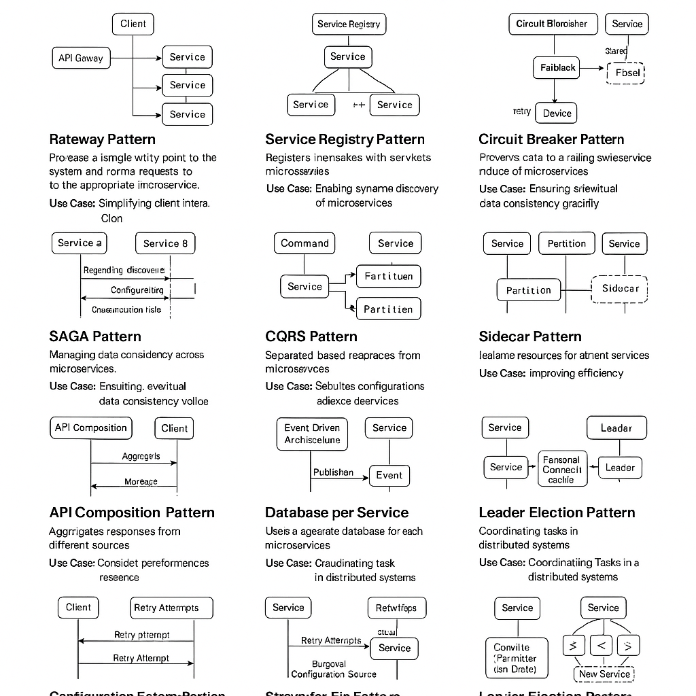

# 🔍 Microservices Design Patterns – In-Depth Guide with Diagrams



This document provides a comprehensive, in-depth look at the **most essential microservices design patterns**. Each pattern is explained with **practical use cases** and a **conceptual flow diagram** to help visualize the pattern in action.

---

## ✅ 1. Gateway Pattern

### 📌 Description:

Acts as a single entry point for all clients, routing requests to the appropriate backend services.

### 🎯 Use Case:

* Client apps do not need to know about internal service structure.
* Handle cross-cutting concerns like authentication, logging, rate limiting.

### 📈 Flow Diagram:

```
[Client] → [API Gateway] ──→ [Service A]
                           └──→ [Service B]
                           └──→ [Service C]
```

---

## ✅ 2. Service Registry Pattern

### 📌 Description:

A central place where services register themselves and query the location of other services dynamically.

### 🎯 Use Case:

* Useful in dynamic environments like Kubernetes or cloud-based systems.
* Enables service discovery and load balancing.

### 📈 Flow Diagram:

```
[Service A] ── Register ──▶ [Service Registry] ◀── Discover ── [Service B]
```

---

## ✅ 3. Circuit Breaker Pattern

### 📌 Description:

Prevents repeated failures when a service is down, by cutting off calls after a threshold.

### 🎯 Use Case:

* Prevents cascading failures.
* Returns fallback response or error immediately after detecting failure pattern.

### 📈 Flow Diagram:

```
[Client] → [Circuit Breaker]
              ├─ Closed → [Service] ✅
              ├─ Open   → Fallback ❌
              └─ Half-Open → Trial request
```

---

## ✅ 4. SAGA Pattern

### 📌 Description:

Manages distributed transactions using local transactions with compensating actions.

### 🎯 Use Case:

* Replace ACID transactions across microservices.
* Common in financial and order processing systems.

### 📈 Flow Diagram (Orchestration):

```
[Saga Coordinator]
    ├─▶ [Service A]
    ├─▶ [Service B]
    └─▶ [Service C]
(Each with compensating rollback if needed)
```

### 📈 Flow Diagram (Choreography):

```
[Service A] ── Event ─▶ [Service B] ── Event ─▶ [Service C]
```

---

## ✅ 5. CQRS (Command Query Responsibility Segregation)

### 📌 Description:

Separates operations that change data (commands) from those that retrieve data (queries).

### 🎯 Use Case:

* Performance optimization in high read-write systems.
* Enables scaling reads and writes independently.

### 📈 Flow Diagram:

```
[Command API] → [Command DB]
[Query API]   → [Read Model DB]
```

---

## ✅ 6. Bulkhead Pattern

### 📌 Description:

Divides services/resources into isolated groups to prevent one failure from affecting the whole system.

### 🎯 Use Case:

* Enhances fault isolation and stability.
* Prevents resource starvation across services.

### 📈 Flow Diagram:

```
[Service Pool A]   [Service Pool B]   [Service Pool C]
(Each with its own thread pool / resource limits)
```

---

## ✅ 7. Sidecar Pattern

### 📌 Description:

Pairs a helper service (sidecar) with the main service to offload responsibilities like monitoring, logging.

### 🎯 Use Case:

* Service mesh implementations.
* Add observability or security features without changing main code.

### 📈 Flow Diagram:

```
[Main Service] ⬌ [Sidecar (Envoy, Fluentd, etc.)]
```

---

## ✅ 8. API Composition Pattern

### 📌 Description:

Aggregates responses from multiple microservices and presents a unified response.

### 🎯 Use Case:

* Frontend clients needing consolidated data.
* Backend-for-Frontend (BFF) implementations.

### 📈 Flow Diagram:

```
[Client] → [API Composer]
           ├─▶ [Service A]
           ├─▶ [Service B]
           └─▶ [Service C]
(Responses merged and sent to Client)
```

---

## ✅ 9. Event-Driven Architecture Pattern

### 📌 Description:

Services emit and respond to events asynchronously.

### 🎯 Use Case:

* Systems that require decoupling and eventual consistency.
* Stream processing and real-time analytics.

### 📈 Flow Diagram:

```
[Producer] → [Event Bus (Kafka, RabbitMQ)] → [Consumers A, B, C]
```

---

## ✅ 10. Database per Service Pattern

### 📌 Description:

Each service owns its database, enforcing loose coupling and data autonomy.

### 🎯 Use Case:

* Avoid shared database contention.
* Enables services to evolve independently.

### 📈 Flow Diagram:

```
[Service A] ↔ [DB A]
[Service B] ↔ [DB B]
[Service C] ↔ [DB C]
```

---

## ✅ 11. Retry Pattern

### 📌 Description:

Automatically retries failed operations based on rules.

### 🎯 Use Case:

* Network issues, temporary unavailability.
* Prevents unnecessary failure propagation.

### 📈 Flow Diagram:

```
Attempt → Failure → Wait → Retry → Success / Max Retry Exceeded
```

---

## ✅ 12. Configuration Externalization Pattern

### 📌 Description:

Moves configuration (env variables, secrets) outside the codebase to be managed centrally.

### 🎯 Use Case:

* Dynamically update config values without redeploy.
* Use across multiple environments.

### 📈 Flow Diagram:

```
[Service] → [Config Server] → [External Store (Git, Vault, etc.)]
```

---

## ✅ 13. Strangler Fig Pattern

### 📌 Description:

Gradually replaces a legacy monolith with microservices by intercepting and routing calls.

### 🎯 Use Case:

* Incremental legacy system replacement.

### 📈 Flow Diagram:

```
[Client] → [Proxy Router]
            ├─▶ [New Microservice Module]
            └─▶ [Legacy Monolith Module]
```

---

## ✅ 14. Leader Election Pattern

### 📌 Description:

A group of nodes elect a leader to perform coordination tasks.

### 🎯 Use Case:

* Distributed scheduling, cluster coordination.

### 📈 Flow Diagram:

```
[Nodes A, B, C] → [Election Algorithm] → [Leader Node] → [Coordination Duties]
```

---

> **Note**: These patterns are composable—most real-world systems combine multiple patterns for resilience, observability, and scalability.

